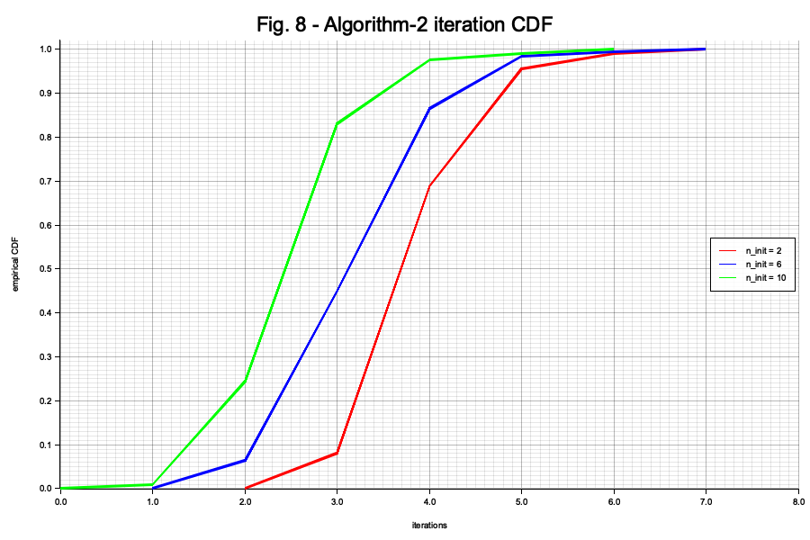
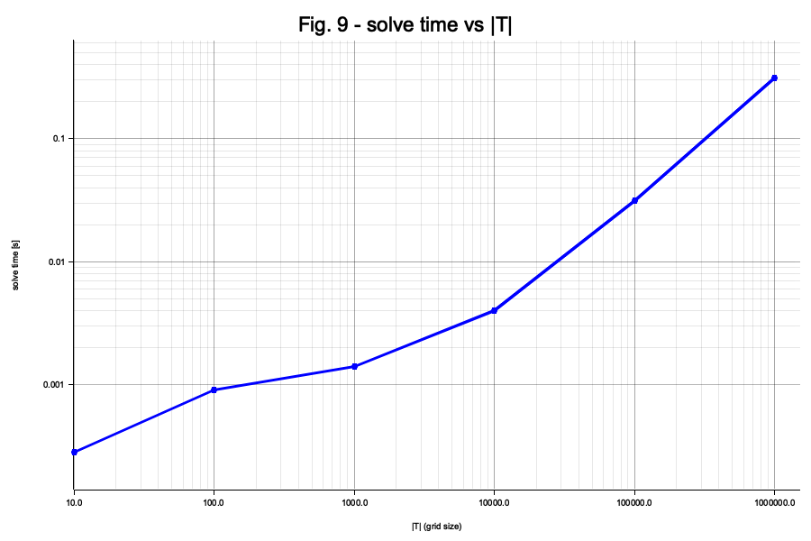

# koenig-damico-planner

A faithful Rust re-implementation of Koenig & D'Amico's fuel-optimal impulsive
control algorithm for linear systems with time-varying cost
(*"Fast Algorithm for Fuel-Optimal Impulsive Control of Linear Systems with
Time-Varying Cost,"* IEEE Transactions on Automatic Control, 2020).

It computes a minimum-Δv impulsive maneuver plan that drives a deputy spacecraft
to a target set of quasi-nonsingular relative orbital elements (ROEs) under J2
secular dynamics, via the paper's three-step reachable-set method:

1. **Initialize** a candidate time grid (Algorithm 1),
2. **Refine** it by solving the dual reachability SOCP and adding/dropping
   contact times until convergence (Algorithm 2),
3. **Extract** the maneuvers by a direct gauge-aware minimum-fuel SOCP over the
   converged active set (Algorithm 3).

## Status & fidelity

- **Dynamics are finite-difference verified.** The J2 mean-ROE state-transition
  matrix `Φ(t,t_f)` and control-input matrix `B(t)` are independently checked by
  `tests/fd_stm.rs` and `tests/fd_b_matrix.rs` at two orbit regimes.
- **STM correction.** The paper's printed `Φ₂₁` δλ-drift term is a transcription
  typo (`−1.5 n Δt²`, dimensionally invalid); this crate uses the correct linear
  `−1.5 n Δt` (the printed Δt² form is dimensionally inconsistent for a rate term). See `src/dynamics/stm.rs`.
- **The worked-example figures are not bit-reproducible.** Under the corrected
  dynamics the paper's §VIII Table IV maneuvers do not reconstruct the Table III
  target, which is consistent with transcription errors in the published example. The crate validates
  the *math* and *self-consistency*, not the printed numbers — see
  `tests/worked_example.rs`.

## Usage

```rust,ignore
use koenig_damico_planner::{solve, SolveParams, TimeGrid};
use koenig_damico_planner::dynamics::{AbsoluteOrbit, J2Roe};
use koenig_damico_planner::cost::Piecewise;
use koenig_damico_planner::Pseudostate;
use std::f64::consts::TAU;

let a_c = 25_000e3; // chief semimajor axis [m], the I/O scale factor
let chief = AbsoluteOrbit::new(
    a_c, 0.7, 40f64.to_radians(), 358f64.to_radians(), 0.0, 180f64.to_radians(),
);
let dynamics = J2Roe::new(chief, 0.0, 117_990.0)?;        // fallible: validates the chief
let grid = TimeGrid::uniform(0.0, 117_990.0, 30.0)?;       // fallible: validates dt>0, t_f>=t_i
let cost = Piecewise::new(TAU / chief.mean_motion());      // eq.49 perigee windows
let w = Pseudostate::from_row_slice(&[50.0, 5000.0, 100.0, 100.0, 0.0, 400.0]) / a_c;

let solution = solve(&dynamics, &cost, w, grid, &SolveParams::default())?;
println!("{} maneuvers, total dv = {:.4} mm/s",
    solution.maneuvers.len(), solution.total_dv * 1e3);
# Ok::<(), koenig_damico_planner::PlannerError>(())
```

A runnable version is `examples/mdot.rs`:

```sh
cargo run --example mdot
```

## Validation harness (Fig. 8 / Fig. 9)

A Monte-Carlo harness reproduces the paper's Fig. 8 (refinement-iteration counts
under three seedings) and Fig. 9 (solve time vs. grid size). It is gated behind
the `validation` feature (which pulls in `rand`, `rand_distr`, `csv`, and
`plotters`); use `--release` for representative timings:

```sh
cargo run --release --bin monte_carlo --features validation
```

This writes the CSVs and the PNGs below under `target/`. The seeded CI invariant
test (`tests/monte_carlo.rs`) runs without the feature flag and asserts only
paper-independent invariants — the paper's reported means are shown here as a
*reference*, not a pass/fail target.

**Fig. 8 — Algorithm-2 iteration distribution.** Empirical CDF of refinement
iterations over 200 random targets per seeding scheme (red n=2 window endpoints;
blue n=6 largest-contact times, i.e. Algorithm 1; green n=10 evenly spaced). Every
solve converges in ≤ 7 iterations — well within the paper's stated 8-iteration
bound — and mean iterations are 4.29 / 3.64 / 2.95 vs. the paper's 4.90 / 3.99 /
3.31.



**Fig. 9 — solve time vs. grid size.** Wall-clock solve time for the Table III
target as the candidate-time grid grows from 10 to 10⁶ points (log–log, release
build). Solve time grows slowly at small |T| (setup-dominated), then scales
roughly linearly in |T| (~0.3 s at 10⁶ points).



## Build & test

```sh
cargo test --all-targets --all-features
```

## License

Licensed under either of [Apache-2.0](LICENSE-APACHE) or [MIT](LICENSE-MIT) at
your option.
